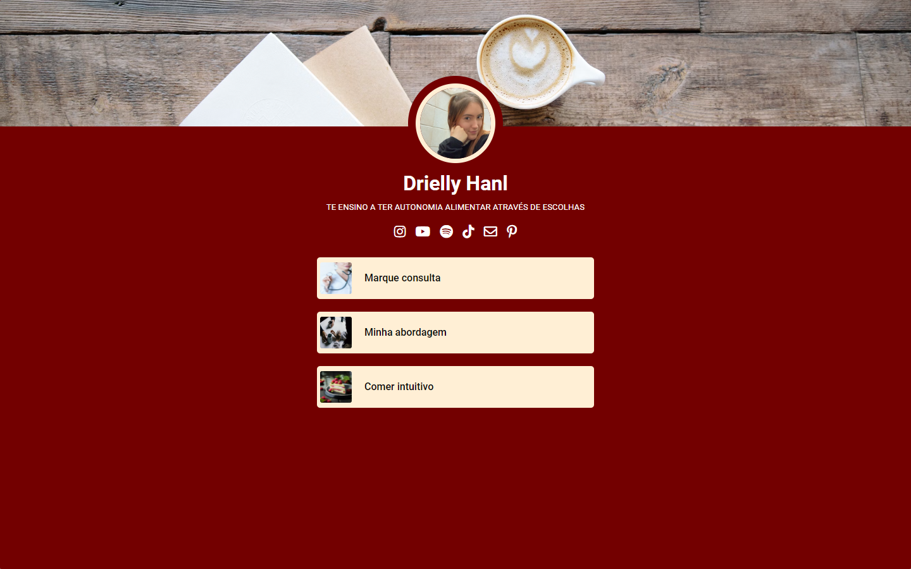

# Landing page Drielly Hanl

## Overview

This repository contains the source code for a simple landing page for a nutritionist named "Drielly Hanl". The page has been developed using HTML, CSS and JS to provide a concise and engaging presentation of the services offered by the nutritionist.

## Features

- You can open WhatsApp for a chat with a pre-filled message.
- The ability to access social media through the icons.
- Responsive design for a great user experience on both desktop and mobile devices.

## Website
https://franzhanl.github.io/nutricionista/

## Desktop 1440x900


## Mobile 412x846


## Getting Started

To get started with this project, follow these steps:

1. Clone the repository:

   ```bash
   git clone https://github.com/franzhanl/nutricionista.git
2. Install the dependencies:

    ```bash
    cd nutricionista
    npm install
3. Start the development server:

    ```bash
    npm start
4. Open your web browser and go to http://localhost:3000 to view the app.

## Technologies Used
 - HTML for create the structure.
 - CSS for style the appearance.
 - JS for element manipulation.
